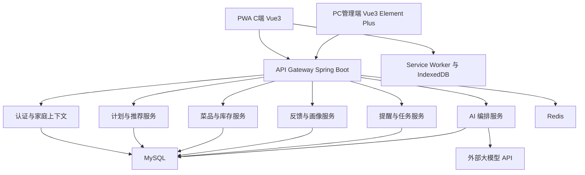

# 宝贝早餐技术方案

## 1. 设计目标

本方案围绕“早餐方案推荐与执行闭环”设计，优先实现以下能力：

- 稳定生成可执行的一周早餐方案
- 让家长快速查看并完成制作
- 让儿童反馈能回流到推荐系统
- 在家庭本地部署场景中保持简单、可维护、可扩展

## 2. 首版范围与阶段划分

### 2.1 MVP 范围

- 账号登录与家庭空间
- 家长端 PWA
- 儿童端 PWA 角色视图
- 今日早餐与一周计划
- 菜品、库存、购物清单、成员管理
- 儿童反馈与口味画像
- AI 推荐、替换、做菜问答
- PC 管理后台
- 基础离线浏览

### 2.2 二期扩展

- 菜品网站采集
- 游戏化体系
- 数据导出备份增强
- 随机推荐“吃什么”扩展
- 多模型路由优化

## 3. 总体架构



### 3.1 前端分层

- `apps/pwa`: 家庭用户端，支持家长模式和儿童模式
- `apps/admin`: PC 管理后台
- `packages/shared`: 公共类型、接口定义、主题令牌、工具函数

### 3.2 后端分层

- `api`: 控制器与 DTO
- `application`: 用例编排层
- `domain`: 领域模型、规则、服务
- `infrastructure`: MyBatis Plus、Redis、对象存储适配、AI Provider 适配
- `scheduler`: 提醒任务、备份任务、预计算任务

## 4. 关键设计决策

### 4.1 以“家庭”为数据隔离主键

所有核心数据以 `family_id` 作为租户边界，支持未来多家庭通用化。

### 4.2 以“早餐方案”为推荐主对象

推荐结果输出为组合餐，而非单一菜品。组合中每个菜品保留独立步骤、库存扣减和营养统计能力。

### 4.3 AI 采用“编排层 + 多模型适配器”

业务层不直接调用模型 API，通过统一编排服务完成提示词构造、上下文拼装、结果校验、回退和审计。

### 4.4 离线采用“读缓存优先，写入排队同步”

PWA 离线时允许读取缓存内容；允许本地记录评价、勾选购物清单等轻量操作，并在恢复联网后同步。

## 5. 核心业务流程

### 5.1 一周早餐计划生成

1. 家长选择生成范围：7 天或工作日。
2. 后端读取家庭成员、过敏限制、口味画像、库存、季节和节假日。
3. 推荐服务先从规则层筛掉冲突菜品。
4. AI 编排服务生成候选早餐方案。
5. 结果校验器检查营养、重复度、库存可行性和节假日适配。
6. 系统保存候选周计划，返回给前端预览。
7. 家长确认后生效为正式周计划。

### 5.2 今日早餐制作

1. 家长进入今日早餐页面。
2. 前端读取今日方案与缓存素材。
3. 用户进入步骤引导模式。
4. 完成制作后确认“已制作”。
5. 系统执行库存扣减并记录制作日志。

### 5.3 儿童反馈闭环

1. 儿童提交星级、表情或文本。
2. 家长代录入口可补充实际进食信息。
3. AI 将文本反馈解析为结构化偏好事件。
4. 画像服务更新孩子的口味标签、食材偏好和排斥趋势。
5. 推荐服务在下次计划中使用最新画像。

### 5.4 AI 做菜求助

1. 用户从步骤页发起提问。
2. 系统拼装当前菜品、当前步骤、历史问答和角色风格。
3. 模型返回指导内容。
4. 安全过滤器去除高风险或不可靠表达。
5. 前端展示简明回答和可追问入口。

## 6. 模块设计

### 6.1 认证与家庭上下文

- 用户名密码登录
- 支持单用户管理多个家庭的扩展字段
- Token 中携带当前家庭和当前角色上下文
- 角色切换后刷新前端主题与 AI 风格参数

### 6.2 家庭成员模块

- 维护成员基础资料、角色、年龄、头像
- 维护过敏原、饮食限制、偏好初始标签
- 支持家长、儿童、其他家庭成员的权限边界

### 6.3 菜品中心

- 菜品基础信息、标签、媒体素材、步骤、营养信息
- 菜品媒体采用本地文件存储抽象层，首版默认挂载磁盘目录
- 支持“系统预置菜品”和“家庭自定义菜品”

### 6.4 早餐方案与计划模块

- `MealTemplate` 表示一餐组合模板
- `WeeklyPlan` 表示某一周的正式计划
- `DailyMeal` 表示某天的一餐实例
- 支持替换单天、拖拽排序、锁定某天不参与重生成

### 6.5 库存与购物清单模块

- 库存记录以食材维度维护数量和单位
- 菜品与食材通过配方明细关联
- 执行计划后扣减库存
- 差量计算器生成购物清单

### 6.6 反馈与画像模块

- 存储原始评价记录
- 存储 AI 解析后的结构化偏好事件
- 周期性聚合为儿童口味画像快照

### 6.7 AI 编排模块

- Provider 管理：DeepSeek、智谱、千问、自定义 OpenAI 兼容接口
- Prompt 模板管理：计划生成、换方案、做菜问答、儿童对话、采购建议
- Result Parser：解析结构化 JSON
- Guardrail：长度、敏感词、营养约束、过敏约束、重复度约束
- Fallback：主模型失败时切换备用模型

### 6.8 节假日与日历模块

- 后台维护国家法定节假日和补班信息
- 计划生成时计算工作日集合
- 支持未来按地区扩展

### 6.9 提醒与通知模块

- 定时任务扫描提醒规则
- 首版支持站内提醒和浏览器通知
- 后续可扩展短信、微信模板消息

## 7. 数据模型设计

### 7.1 核心表

- `user`
- `family`
- `family_member`
- `member_dietary_rule`
- `dish`
- `dish_media`
- `dish_step`
- `ingredient`
- `dish_ingredient`
- `inventory_item`
- `weekly_plan`
- `daily_meal`
- `daily_meal_dish`
- `meal_generation_task`
- `taste_feedback`
- `taste_event`
- `taste_profile_snapshot`
- `shopping_list`
- `shopping_list_item`
- `holiday_calendar`
- `ai_model_config`
- `ai_conversation`
- `ai_message`
- `notification_rule`
- `notification_log`
- `backup_record`

### 7.2 关键字段建议

#### `dish`

- `id`
- `family_id`
- `name`
- `cover_image_url`
- `difficulty`
- `estimated_minutes`
- `nutrition_summary`
- `suitable_scene_tags`
- `flavor_tags`
- `season_tags`
- `status`

#### `weekly_plan`

- `id`
- `family_id`
- `week_start_date`
- `plan_scope`
- `status`
- `generated_by`
- `generation_reason`
- `confirmed_at`

#### `daily_meal`

- `id`
- `weekly_plan_id`
- `meal_date`
- `meal_type`
- `theme_reason`
- `is_holiday`
- `is_locked`

#### `taste_feedback`

- `id`
- `family_id`
- `member_id`
- `daily_meal_id`
- `rating_star`
- `emoji_code`
- `feedback_text`
- `recorded_by`
- `source_type`

### 7.3 索引建议

- `family_id + week_start_date`
- `family_id + meal_date`
- `family_id + member_id + created_at`
- `family_id + ingredient_id`
- `status + next_trigger_at`

## 8. API 设计

### 8.1 C 端接口

- `POST /api/auth/login`
- `GET /api/home/today-breakfast`
- `POST /api/plans/generate`
- `GET /api/plans/{id}`
- `PUT /api/plans/{id}/confirm`
- `PUT /api/plans/{id}/reorder`
- `POST /api/plans/{id}/days/{dayId}/replace`
- `GET /api/dishes/{id}`
- `POST /api/cooking/sessions`
- `POST /api/feedback`
- `POST /api/ai/chat`
- `GET /api/inventory`
- `GET /api/shopping-lists/current`

### 8.2 管理后台接口

- `GET /api/admin/dishes`
- `POST /api/admin/dishes`
- `POST /api/admin/dishes/import`
- `POST /api/admin/dishes/ai-generate`
- `GET /api/admin/holidays`
- `PUT /api/admin/holidays/batch`
- `GET /api/admin/models`
- `POST /api/admin/models`
- `PUT /api/admin/models/{id}/status`
- `GET /api/admin/members`
- `GET /api/admin/reports/nutrition`

### 8.3 返回规范

- 统一返回 `code`、`message`、`data`、`requestId`
- AI 结构化接口返回附加字段 `modelInfo`、`traceId`、`fallbackUsed`

## 9. AI 设计

### 9.1 推荐策略

推荐流程采用“规则过滤 + AI 组合 + 结果校验”三段式：

1. 规则过滤：去除过敏、年龄不适宜、库存明显不足、重复度过高菜品。
2. AI 组合：依据场景和目标生成多菜品早餐方案。
3. 结果校验：校验营养覆盖、烹饪复杂度、用户偏好匹配度。

### 9.2 Prompt 上下文

- 家庭成员信息与角色
- 孩子偏好摘要
- 最近 14 天已吃早餐摘要
- 当前库存摘要
- 节日、季节、天气扩展位
- 当前任务目标

### 9.3 输出协议

所有推荐型 AI 输出采用 JSON Schema 约束，例如：

```json
{
  "title": "周二营养早餐",
  "reason": "天气偏凉，适合热食；孩子最近偏爱面食",
  "dishes": [
    {
      "dishName": "番茄鸡蛋面",
      "servings": 2,
      "ingredientFit": "high"
    }
  ],
  "nutritionFocus": ["protein", "vitamin_c"],
  "shoppingNeeds": ["挂面"]
}
```

### 9.4 AI 失败回退

- 主模型超时或失败时切换备用模型
- 结构化解析失败时走修复提示词二次解析
- 连续失败时返回规则引擎生成的基础推荐结果

## 10. 前端设计

### 10.1 PWA 信息架构

- 首页：今日早餐、快捷 AI、提醒卡片
- 计划页：周视图、生成按钮、拖拽调整
- 菜品页：菜品详情、步骤、营养、收藏
- 库存页：库存、缺货提醒、购物清单
- 儿童页：今日早餐、评价、成就、AI 对话
- 我的页：家庭成员、提醒设置、模型选择

### 10.2 双模式 UI

- 通过角色切换驱动主题令牌和组件尺寸
- 家长模式强调信息密度和流程效率
- 儿童模式强调大字号、图形化入口和即时反馈

### 10.3 离线缓存策略

- `Service Worker` 缓存静态资源和最近访问数据
- `IndexedDB` 存储今日方案、周计划、菜品详情、成员资料、待同步操作
- 使用版本号控制缓存失效与迁移

## 11. PC 管理后台设计

### 11.1 功能模块

- 仪表盘
- 菜品中心
- 节假日日历
- AI 模型配置
- 家庭成员管理
- 报表中心
- 系统设置

### 11.2 菜品管理重点

- 表格检索 + 分类筛选 + 标签维护
- 菜品编辑器支持步骤、配图、视频、营养信息
- 批量导入采用异步任务机制

### 11.3 模型配置重点

- 支持多个 Provider
- 支持启用、停用、优先级排序
- 支持健康检查和连通性测试

## 12. 安全与权限

- 基于 Spring Security + JWT
- 家长拥有家庭级管理权限
- 儿童角色只开放查看、评价、建议提交等有限动作
- AI 模型密钥加密存储
- 操作日志记录关键配置变更

## 13. 部署方案

### 13.1 容器划分

- `baby-breakfast-api`
- `baby-breakfast-pwa`
- `baby-breakfast-admin`
- `baby-breakfast-mysql`
- `baby-breakfast-redis`

### 13.2 存储规划

- MySQL 存储业务数据
- Redis 存储会话、缓存、任务状态
- 本地挂载目录存储菜品媒体、导出文件、备份文件

### 13.3 部署形态

- `docker compose` 支持 NAS 和家庭主机一键启动
- 云服务器场景使用同构容器部署

## 14. 可观测性

- 请求日志带 `requestId`
- AI 调用日志带 `traceId`
- 定时任务执行日志
- 关键报表和推荐耗时监控
- 后台模型健康状态监控

## 15. 风险与应对

### 15.1 AI 结果不稳定

- 采用结构化输出、规则校验和回退策略

### 15.2 家庭本地部署环境差异大

- 提供 Docker 标准部署与健康检查脚本

### 15.3 媒体资源体积大

- 图片压缩、视频大小限制、缩略图预生成

### 15.4 离线与同步冲突

- 使用操作队列和更新时间戳处理最终一致性

## 16. 实施建议

### 16.1 里程碑一

- 完成账户、家庭成员、菜品、计划、库存基础能力
- 打通今日早餐查看和一周计划生成主链路

### 16.2 里程碑二

- 接入 AI 编排、儿童反馈、口味画像、购物清单

### 16.3 里程碑三

- 完成后台模型管理、节假日配置、营养报表、离线增强

## 17. 推荐目录结构

```text
apps/
  pwa/
  admin/
server/
  src/main/java/.../
packages/
  shared/
deploy/
  docker-compose.yml
docs/
```
